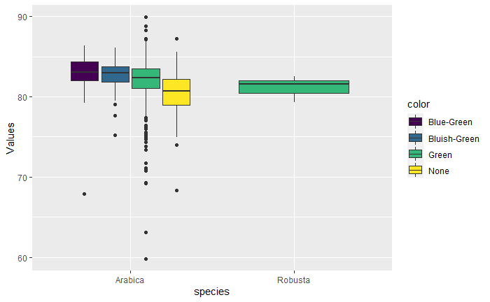
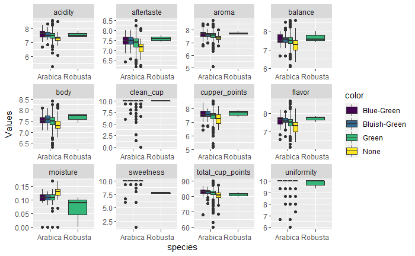
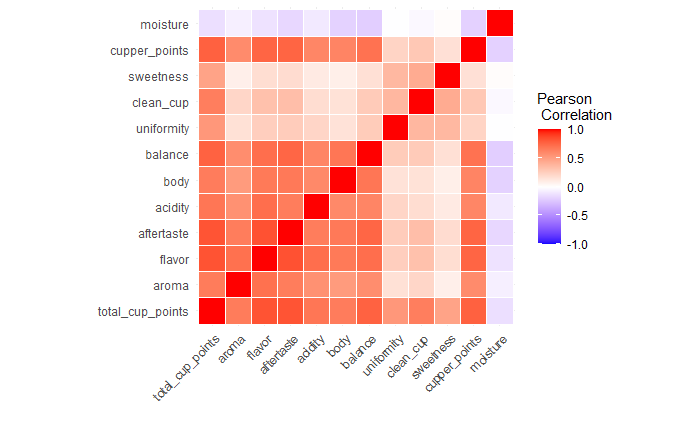
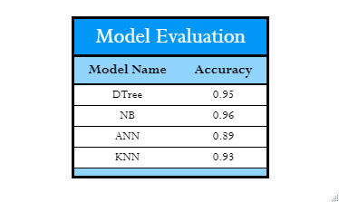
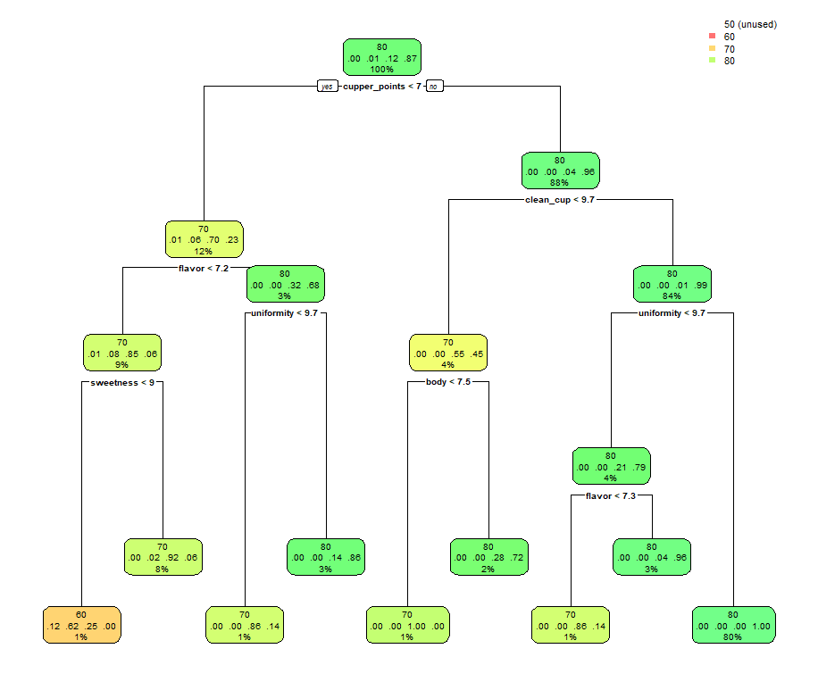

# Coffee Analysis

## Citation
>From TidyTuesday 
URL:https://github.com/rfordatascience/tidytuesday/tree/master/data/2020/2020-07-07

## Data

Note: within the above link, there was already some pre-processing done to the data with the column and value names.

Some removal of columns due to an overabundance of missing values.

### Data Dictionary 

>Note full description/examples at: [Coffee Quality Institute](https://database.coffeeinstitute.org/coffee/357789/grade)

|variable              |class     |description |
|:---------------------|:---------|:-----------|
|total_cup_points      |double    | Total rating/points (0 - 100 scale) |
|species               |character | Species of coffee bean (arabica or robusta) |
|country_of_origin     |character | Where the bean came from |
|region                |character | Region where bean came from |
|harvest_year          |character | When the beans were harvested (year) |
|grading_date          |character | When the beans were graded|
|variety               |character | Variety of the beans |
|processing_method     |character | Method for processing|
|aroma                 |double    | Aroma grade |
|flavor                |double    | Flavor grade |
|aftertaste            |double    | Aftertaste grade |
|acidity               |double    | Acidity grade |
|body                  |double    | Body grade |
|balance               |double    | Balance grade |
|uniformity            |double    | Uniformity grade |
|clean_cup             |double    | Clean cup grade |
|sweetness             |double    | Sweetness grade |
|cupper_points         |double    | Cupper Points|
|moisture              |double    | Moisture Grade|
|color                 |character | Color of bean |

## EDA

Viewing the distribution of the given coffee's overall evaluation between the two main species.

Distributions of many of the fields that were evaluated.

Heatmpap to infer Correlations between fields.

## Predictive Modeling

### Preferred Model

While the most accurate model, given the seed and fields, was Naive Bayes; a Decision Tree in this case being very close in accuracy is easier to visualize and describe to a reader. 

